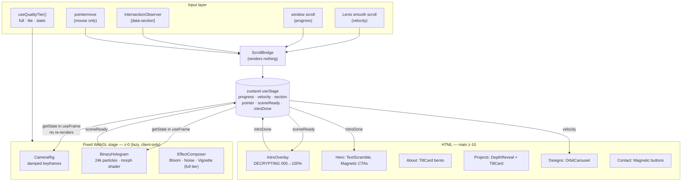

# 🌌 3D Motion Portfolio Guide
### Hirusha Suhan Portfolio — "Binary Hologram" Edition

> How to turn this Next.js 16 portfolio from a 2D cyber site into a **scroll-driven 3D motion portfolio**: one persistent WebGL scene lives behind the page, a particle "hologram" of your portrait morphs into a new shape for every section, the camera travels as you scroll, and the HTML sections gain real depth (3D tilt, depth reveals, an orbit carousel).
>
> Written for **this repo**: Next.js 16.3 (App Router, static export) · React 19.2 · Tailwind CSS v4 · Framer Motion 12 · GitHub Pages. Every code block in §6–§8 was type-checked (TypeScript 5.9), linted with `eslint-config-next@16.3.6`, built with `next build`, and rendered in headless Chromium on **29 Sep 2026**.

---

## 📑 Table of Contents

1. [Project audit: where the site is today](#1-project-audit-where-the-site-is-today)
2. [Research: what 3D motion portfolios do in 2026](#2-research-what-3d-motion-portfolios-do-in-2026)
3. [Creative direction: the Binary Hologram](#3-creative-direction-the-binary-hologram)
4. [Stack & installation](#4-stack--installation)
5. [Architecture](#5-architecture)
6. [Step 0 — Fixes you need before any 3D](#6-step-0--fixes-you-need-before-any-3d)
7. [Core engine recipes](#7-core-engine-recipes)
8. [DOM motion recipes (section by section)](#8-dom-motion-recipes-section-by-section)
9. [Section choreography map](#9-section-choreography-map)
10. [Performance budget](#10-performance-budget)
11. [Accessibility & reduced motion](#11-accessibility--reduced-motion)
12. [Mobile strategy](#12-mobile-strategy)
13. [Build roadmap](#13-build-roadmap)
14. [Debugging checklist](#14-debugging-checklist)
15. [Level-ups (optional)](#15-level-ups-optional)
16. [References](#16-references)

---

## 1. Project audit: where the site is today

**What already works in your favour**

| Area | Current state | Why it matters for 3D |
| :--- | :--- | :--- |
| Theme | Pure black canvas, cyan `#06b6d4` + violet accents, JetBrains Mono | Black is the perfect stage for additive-blended glowing particles. |
| Motion | Framer Motion 12 fade-ups, hero parallax blobs, navbar spring, infinite marquee | Motion stays as the DOM animation engine — no need to add GSAP. |
| Signature visual | 2D Canvas Matrix rain (`1`/`0`) | Becomes the *story*: binary rain → particles → your face. |
| Assets | Dark-studio portrait (`public/my photo/Man_in_dark_studio_portrait_2K_…jpg`, 2752×1536, black background) | Ideal for sampling into a particle point cloud — the background drops out automatically. |
| Deploy | Static export (`output: "export"`) → GitHub Pages via Actions | Everything must be client-side; no server needed for WebGL. |

**Blockers and bugs found (fix these first — see §6)**

| # | Where | Problem | Effect on a 3D site |
| :-- | :--- | :--- | :--- |
| 1 | `.github/workflows/deploy.yml` + `next.config.ts` | `actions/configure-pages` with `static_site_generator: next` only edits `next.config.js/.cjs/.mjs`. With a `.ts` config it writes a **new `next.config.js`**, and Next.js loads `next.config.js` *before* `next.config.ts` — so your TS config is silently ignored in CI, and `basePath` becomes `/hirusha_suhan_me`. | Plain URLs such as `src="/me.png"`, `href="/Hirusha suhan.pdf"` and any future `/3d/*.webp` or `/models/*.glb` are **not** prefixed with `basePath` by Next.js (only `<Link>` and router paths are). Textures/models will 404 in production. |
| 2 | `layout.tsx` → `<html className="scroll-smooth">` | CSS smooth scrolling | Fights Lenis smooth scroll (double easing, anchor jumps break). |
| 3 | `page.tsx` → `<main className="overflow-hidden bg-black">` | `bg-black` paints over anything behind `main`; `overflow-hidden` disables `position: sticky` in all children | The fixed WebGL canvas would be invisible; pinned/sticky scroll chapters impossible. |
| 4 | `globals.css` | Light-mode `:root { --background: #fff }` + unlayered `body { background: var(--background) }` beats Tailwind's layered `bg-black` utility | White overscroll/flash for visitors whose OS is in light mode. |
| 5 | `hero.tsx` → `animate-spin-slow` | Not defined in Tailwind v4 | Avatar ring doesn't spin. |
| 6 | `matrix-rain.tsx` | Trails painted with opaque black; columns never recomputed on resize; always animating | Would cover the 3D scene with a black veil; broken after window resize. |
| 7 | `public/` images | `Expense-Tracker.png` 7.5 MB, `bus-management-system.png` 7.8 MB, `visa consultation.png` 7.8 MB, `design 1.png` 7.4 MB, `me.png` 2 MB, portrait 2.5 MB (~35 MB total) | Kills LCP and leaves no budget for 3D. Convert to WebP ≤ 300 KB each. |
| 8 | Navbar | No `#about` link | Add it — the 3D journey has five chapters; the nav should expose them. |
| 9 | `ANIMATION_GUIDE2.md` | A generic React + Vite version of a 3D guide | Superseded by this file (this guide is Next.js-specific). Safe to delete. |

---

## 2. Research: what 3D motion portfolios do in 2026

**The dominant stack** in award-level portfolios is Three.js through **React Three Fiber (R3F)**, a smooth-scroll layer (**Lenis**), and a DOM animation library (GSAP or Motion). Scroll acts as the timeline; the WebGL scene sits in one fixed canvas behind semantic HTML.

**Patterns that keep showing up** (from Awwwards/Codrops coverage and the 2026 "best Three.js sites" round-ups):

| Pattern | Effort | Example sites | Used here? |
| :--- | :--- | :--- | :--- |
| **One object with weight** — a single signature 3D object that persists and transforms | Low | Oryzo, Hubtown (glowing monolith with mouse reveal) | ✅ Binary Hologram |
| **Scroll as narrative** — camera moves between "chapters" | Medium | Shopify Editions, Sleep Well Creative, bilal.show, sebastien-lempens.com | ✅ Keyframed camera per section |
| **Explorable world / playable portfolio** — drive/walk around | High | bruno-simon.com, jayransijn.com, jordan-breton.com | ❌ Too heavy for this content |
| **DOM ↔ WebGL image planes** — HTML images replaced by shader planes (distortion, pixel reveal) | Medium-High | Codrops "Scroll-Revealed WebGL Gallery" (Feb 2026) | ⏭ Optional level-up (§15) |
| **WebGPU + TSL shaders** | Medium | IVRESS, samsy.ninja (cyberpunk world), ameen-abdullah.dev | ⏭ Later (see note below) |
| **Performance as a feature** — instancing, strict asset budgets, adaptive quality | — | All of the above | ✅ Quality tiers + budgets |

**Ecosystem facts checked on 29 Sep 2026**

- **three.js r186** is current. WebGPU is on by default in Chrome, Edge, Firefox and Safari 26, and `WebGPURenderer` falls back to WebGL 2. **But** `@react-three/postprocessing` (Bloom, Noise…) is built on the WebGL-only `postprocessing` library, so this guide stays on the default `WebGLRenderer`. Revisit WebGPU + TSL when you rewrite effects with three's own `RenderPipeline`.
- **R3F 9.8.1** targets React 19 (peer range `>=19 <19.4` — you're on 19.2.3 ✅). **drei 10.7.9** requires fiber 9. R3F v10 is still alpha — don't use it yet.
- **R3F prints `THREE.Clock: This module has been deprecated`** with three r183+. It's a harmless warning from the library; the recipes below never touch `state.clock`.
- **drei `<Environment preset="…">` downloads HDRs from a third-party CDN** (`raw.githack.com`). The hologram doesn't need environment lighting at all; if you add lit meshes later, self-host the `.hdr` or use `<Lightformer>`s.
- **GSAP** (3.15, all plugins free since the Webflow acquisition) is excellent, but you already ship Motion. Motion's `useScroll` + CSS `position: sticky` covers pinning and scrubbing, so this guide avoids a second animation library. Add GSAP only if you want SplitText or complex pinned timelines.
- **Motion 13** is out. The only breaking change is removing the optional `@emotion/is-prop-valid` dependency (irrelevant here). Upgrading is optional; the new canonical import is `motion/react` (the `motion` package). Recipes below import from `framer-motion` to match your code, and both work.

---

## 3. Creative direction: the Binary Hologram

**The idea:** your Matrix rain was always a hint. In 3D the `1`s and `0`s become ~24,000 glowing particles that **assemble into your portrait** in the hero, then **re-form into a new structure for every chapter** as you scroll. At each transition they briefly "rain" downward, a callback to the binary rain.

| Decision | Choice |
| :--- | :--- |
| Signature 3D object | GPU particle system (`THREE.Points` + custom shader) that morphs between five shapes |
| Hero shape | **Portrait hologram** sampled from the dark-studio photo (brightness → density and depth) |
| Palette | `#000000` stage · `#06b6d4` cyan (primary particles) · `#8b5cf6` violet (~18% of particles) · `#ffffff` rare sparks · `#22c55e` optional matrix-green accents |
| Typography | Keep JetBrains Mono (the terminal voice is the brand) |
| The one "wow" moment | Page load: particles burst from the centre and resolve into your face while the name decrypts |
| Rules | One canvas, one object. Scroll drives the big moves; time only adds small idle motion. Text must stay readable at every scroll position — the hologram gets dimmer where content is dense. |

**Per-section shapes**

| Section | Shape | Meaning |
| :--- | :--- | :--- |
| Hero | Portrait hologram | *This is me* |
| About | Network globe (Fibonacci sphere + latitude bands), slowly spinning | IPv6/networking research, a global mindset |
| Projects | Data terrain (wavy grid floor under the cards) | Systems you've engineered |
| Designs | Orbit ring, tilted, spinning around the 3D carousel | Creative work in orbit |
| Contact | Signal (concentric broadcast rings) | *Send me a message* |

---

## 4. Stack & installation

| Purpose | Package | Version checked |
| :--- | :--- | :--- |
| 3D renderer | `three` | 0.186.1 |
| React renderer for three | `@react-three/fiber` | 9.8.1 |
| Helpers (`PerformanceMonitor`, `AdaptiveDpr`, `View`, …) | `@react-three/drei` | 10.7.9 |
| Post-processing (Bloom, Noise, Vignette) | `@react-three/postprocessing` | 3.1.3 |
| Smooth scroll | `lenis` | 1.3.26 |
| Frame-rate-independent damping | `maath` | 0.10.8 |
| DOM ↔ 3D shared state | `zustand` | 5.0.15 |
| DOM animation (already installed) | `framer-motion` | 12.x (13.4.4 available) |
| Image prep for the hologram (dev only) | `sharp` | latest |

```bash
npm i three @react-three/fiber @react-three/drei @react-three/postprocessing lenis maath zustand
npm i -D @types/three sharp
```

Nothing else is needed for Next.js 16: Turbopack (the default bundler) handles three.js as-is, and shaders live in template strings, so there's no GLSL loader to configure.

---

## 5. Architecture



**Layer stack (bottom → top)**

```
z-0    StageLoader      fixed, pointer-events:none, aria-hidden   → WebGL canvas (opaque black)
z-1    MatrixRain       fixed, 20% opacity, transparent trails   → 2D binary rain over the 3D
z-10   <main>           relative, transparent background          → all real content
z-50   Navbar           fixed
z-60   ScrollProgress   fixed 2px laser
z-100  IntroOverlay     fixed, removed after intro
```

**The golden rule:** DOM code *writes* numbers into the store; the render loop *reads* them with `useStage.getState()` and eases toward them with `maath/easing`. React never re-renders on scroll, and damping makes every move feel physical.

**Quality tiers** (decided once on the client):

| Tier | Who | What renders |
| :--- | :--- | :--- |
| `full` | Desktop, >4 cores, >4 GB RAM | 24k particles, DPR up to 2, Bloom + Noise + Vignette |
| `lite` | Touch devices, ≤4 cores or ≤4 GB | 9k particles, DPR 1–1.25, no post-processing |
| `static` | `prefers-reduced-motion`, Save-Data, or no WebGL2 | No canvas at all — today's 2D site (avatar, Matrix rain still frame) |

**New files**

```
next.config.ts                       (edit)  basePath from CI
scripts/make-portrait.mjs            (new)   crops + grades the portrait for sampling
scripts/optimize-images.mjs          (new)   PNG/JPG → WebP
public/3d/portrait.webp              (generated, ~15 KB)
src/lib/asset.ts                     (new)   basePath-safe URLs
src/store/stage.ts                   (new)   zustand store
src/hooks/use-quality-tier.ts        (new)
src/components/providers/
  ├─ smooth-scroll.tsx               (new)   Lenis
  └─ scroll-bridge.tsx               (new)   scroll/section/pointer → store
src/components/three/
  ├─ stage-loader.tsx                (new)   dynamic(ssr:false) gate
  ├─ experience.tsx                  (new)   <Canvas>, perf monitor, effects
  ├─ binary-hologram.tsx             (new)   the particle system
  ├─ hologram-shaders.ts             (new)   GLSL
  ├─ shapes.ts                       (new)   portrait sampler + 4 procedural shapes
  ├─ keyframes.ts                    (new)   camera/object pose per section
  └─ camera-rig.tsx                  (new)
src/components/motion/
  ├─ intro-overlay.tsx               (new)
  ├─ text-scramble.tsx               (new)
  ├─ tilt-card.tsx                   (new)
  ├─ depth-reveal.tsx                (new)
  ├─ orbit-carousel.tsx              (new)
  ├─ magnetic.tsx                    (new)
  └─ scroll-progress.tsx             (new)
src/components/ui/matrix-rain.tsx    (rewrite)
src/app/layout.tsx, page.tsx, globals.css, sections/*  (edit)
```

---

## 6. Step 0 — Fixes you need before any 3D

### 6.1 Own the `basePath` (fixes audit #1)

`next.config.ts`:
```ts
import type { NextConfig } from "next";

// Set by the GitHub Actions workflow from actions/configure-pages → "/hirusha_suhan_me"
// (empty string locally, and empty if you later add a custom domain)
const basePath = process.env.PAGES_BASE_PATH ?? "";

const nextConfig: NextConfig = {
  output: "export",
  basePath,
  images: { unoptimized: true },
  env: { NEXT_PUBLIC_BASE_PATH: basePath }, // read by src/lib/asset.ts
};

export default nextConfig;
```

`.github/workflows/deploy.yml`: give the Pages step an `id`, **remove** `static_site_generator: next` (so no stray `next.config.js` is generated), and pass the base path into the build:

```yaml
      - name: Setup Pages
        id: pages
        uses: actions/configure-pages@v5
        # (no static_site_generator line)

      # ...

      - name: Build with Next.js
        run: ${{ steps.detect-package-manager.outputs.runner }} next build
        env:
          PAGES_BASE_PATH: ${{ steps.pages.outputs.base_path }}
```

`src/lib/asset.ts` — use it for **every** `public/` URL that isn't a `<Link>`:
```ts
// Prefixes public/ paths with the GitHub Pages base path.
// next/image, <a href>, fetch() and three.js loaders do NOT add basePath for you.
export const BASE_PATH = process.env.NEXT_PUBLIC_BASE_PATH ?? "";

export function asset(path: string) {
  const clean = path.startsWith("/") ? path : `/${path}`;
  return encodeURI(`${BASE_PATH}${clean}`); // handles "my photo/..." and "Hirusha suhan.pdf"
}
```

```tsx
<Image src={asset("/me.png")} … />
<a href={asset("/Hirusha suhan.pdf")} …>Download CV</a>
```

> Test the real production path locally (bash / Git Bash):
> ```bash
> PAGES_BASE_PATH=/hirusha_suhan_me npm run build
> mkdir -p preview && rm -rf preview/hirusha_suhan_me && cp -r out preview/hirusha_suhan_me
> npx serve preview   # open http://localhost:3000/hirusha_suhan_me/
> ```
> Any image or file that 404s here will 404 on GitHub Pages too.

### 6.2 `globals.css` (fixes audit #4, #5 + adds the intro failsafe)

```css
@import "tailwindcss";

@theme {
  --animate-spin-slow: spin 8s linear infinite;
  --animate-intro-failsafe: intro-failsafe 0.4s ease 4s forwards;

  @keyframes intro-failsafe {
    to { opacity: 0; visibility: hidden; }
  }
}

@theme inline {
  --font-mono: var(--font-mono);
}

:root {
  color-scheme: dark;
  --background: #000000;
  --foreground: #ededed;
}

html,
body {
  background: var(--background);
  color: var(--foreground);
  font-family: var(--font-mono);
}

@media (prefers-reduced-motion: reduce) {
  *, ::before, ::after {
    animation-duration: 0.01ms !important;
    animation-iteration-count: 1 !important;
    transition-duration: 0.01ms !important;
  }
}
```

### 6.3 `layout.tsx` — mount the engine (fixes audit #2)

Keep your `metadata` and font setup exactly as they are; change the imports and the `<html>/<body>` tree:

```tsx
import { SmoothScroll } from "@/components/providers/smooth-scroll";
import { ScrollBridge } from "@/components/providers/scroll-bridge";
import { StageLoader } from "@/components/three/stage-loader";
import { IntroOverlay } from "@/components/motion/intro-overlay";
import { ScrollProgress } from "@/components/motion/scroll-progress";
import { MatrixRain } from "@/components/ui/matrix-rain";

export default function RootLayout({ children }: Readonly<{ children: React.ReactNode }>) {
  return (
    // "scroll-smooth" removed: CSS smooth scrolling fights Lenis
    <html lang="en" className="dark">
      <head>
        <meta httpEquiv="X-Content-Type-Options" content="nosniff" />
      </head>
      <body
        className={cn(
          "min-h-screen bg-black font-mono text-white antialiased selection:bg-cyan-500/30 selection:text-cyan-200",
          jetbrainsMono.variable,
        )}
      >
        <SmoothScroll>
          <ScrollBridge />
          <StageLoader />   {/* z-0   fixed WebGL stage    */}
          <MatrixRain />    {/* z-1   moved here from hero */}
          <IntroOverlay />  {/* z-100 preloader            */}
          <ScrollProgress />
          <Navbar />
          {children}
        </SmoothScroll>
      </body>
    </html>
  );
}
```

### 6.4 `page.tsx` — a transparent, sticky-friendly `<main>` (fixes audit #3)

```tsx
<main className="relative z-10 flex min-h-screen flex-col overflow-x-clip">
```

`overflow-x-clip` still stops horizontal scrollbars but, unlike `overflow-hidden`, it doesn't break `position: sticky`. Remove `bg-black` from `main`, and in `contact.tsx` change the footer's `bg-black` to `bg-black/60 backdrop-blur-sm` so the signal rings glow through.

### 6.5 Mark the chapters

Add `data-section` to each section root. The IDs must match `SECTIONS` in the store:

```tsx
<section data-section="hero" …>                    // hero.tsx
<section id="about" data-section="about" …>        // about.tsx
<section id="projects" data-section="projects" …>  // projects.tsx
<section id="designs" data-section="designs" …>    // designs.tsx
<footer id="contact" data-section="contact" …>     // contact.tsx
```

Add `{ name: "About", href: "#about" }` to `navItems` in `navbar.tsx`.

### 6.6 Shrink the images (fixes audit #7)

`scripts/optimize-images.mjs` (needs `sharp` from §4) writes a `.webp` next to every PNG/JPG over 300 KB in `public/` and keeps the originals:
```js
// Converts heavy PNG/JPG files in public/ to WebP next to the originals: node scripts/optimize-images.mjs
import sharp from "sharp";
import { readdir, stat } from "node:fs/promises";
import path from "node:path";

const DIR = "public";
const MAX_WIDTH = 1600;
const MIN_BYTES = 300 * 1024; // only touch files bigger than 300 KB

for (const name of await readdir(DIR)) {
  if (!/\.(png|jpe?g)$/i.test(name)) continue;
  const src = path.join(DIR, name);
  if ((await stat(src)).size < MIN_BYTES) continue;
  const out = src.replace(/\.(png|jpe?g)$/i, ".webp");
  const info = await sharp(src).resize({ width: MAX_WIDTH, withoutEnlargement: true }).webp({ quality: 78 }).toFile(out);
  console.log(`${name} → ${path.basename(out)} (${Math.round(info.size / 1024)} KB)`);
}
```

Run `node scripts/optimize-images.mjs`, then point the `image:` paths in `projects.tsx` and `designs.tsx` at the `.webp` files (e.g. `/Expense-Tracker.webp`). Delete the old PNGs once you've checked the new files.

---

## 7. Core engine recipes

### 7.1 Store — `src/store/stage.ts`
```ts
import { create } from "zustand";

export const SECTIONS = ["hero", "about", "projects", "designs", "contact"] as const;
export type SectionId = (typeof SECTIONS)[number];
export type QualityTier = "full" | "lite" | "static";

interface StageState {
  progress: number; // 0 → 1 over the whole page
  velocity: number; // Lenis scroll velocity (px/frame, signed)
  section: SectionId; // section currently crossing the viewport centre
  pointer: { x: number; y: number }; // -1 → 1, y up
  sceneReady: boolean; // particles built, safe to reveal
  introDone: boolean; // preloader finished → hero choreography may play
}

// Read with useStage.getState() inside useFrame / rAF loops (no re-render).
// Subscribe with useStage((s) => s.x) only in DOM components that must re-render.
export const useStage = create<StageState>(() => ({
  progress: 0,
  velocity: 0,
  section: "hero",
  pointer: { x: 0, y: 0 },
  sceneReady: false,
  introDone: false,
}));
```

### 7.2 Quality tier — `src/hooks/use-quality-tier.ts`
Uses `useSyncExternalStore`, so it has no `setState`-in-effect (Next 16's React Compiler lint rules flag that) and is SSR-safe for static export.
```ts
"use client";

import { useSyncExternalStore } from "react";
import type { QualityTier } from "@/store/stage";

type NavigatorExtras = Navigator & {
  deviceMemory?: number;
  connection?: { saveData?: boolean };
};

function detectTier(): QualityTier {
  if (window.matchMedia("(prefers-reduced-motion: reduce)").matches) return "static";

  const nav = navigator as NavigatorExtras;
  if (nav.connection?.saveData) return "static";

  const probe = document.createElement("canvas");
  const gl = probe.getContext("webgl2");
  if (!gl) return "static";
  gl.getExtension("WEBGL_lose_context")?.loseContext(); // free the probe context

  const cores = nav.hardwareConcurrency ?? 4;
  const memory = nav.deviceMemory ?? 4; // Chromium only; others default to 4
  const coarse = window.matchMedia("(pointer: coarse)").matches;

  if (coarse || cores <= 4 || memory <= 4) return "lite";
  return "full";
}

let cached: QualityTier | null = null;

function subscribe(onChange: () => void) {
  const mq = window.matchMedia("(prefers-reduced-motion: reduce)");
  const handler = () => {
    cached = null;
    onChange();
  };
  mq.addEventListener("change", handler);
  return () => mq.removeEventListener("change", handler);
}

const getSnapshot = () => (cached ??= detectTier());
const getServerSnapshot = () => null; // static export: no tier at build time

/** null during SSR/first paint, then "full" | "lite" | "static". */
export function useQualityTier() {
  return useSyncExternalStore(subscribe, getSnapshot, getServerSnapshot);
}
```

### 7.3 Smooth scroll — `src/components/providers/smooth-scroll.tsx`
```tsx
"use client";

import type { ReactNode } from "react";
import { ReactLenis } from "lenis/react";
import { useReducedMotion } from "framer-motion";
import "lenis/dist/lenis.css";

export function SmoothScroll({ children }: { children: ReactNode }) {
  const reduce = useReducedMotion();
  if (reduce) return <>{children}</>; // native scrolling for reduced-motion users

  return (
    <ReactLenis
      root
      options={{
        lerp: 0.1, // lower = floatier. 0.08–0.12 feels premium without lag
        wheelMultiplier: 0.9,
        anchors: { offset: -96 }, // #projects links land below the floating navbar
      }}
    >
      {children}
    </ReactLenis>
  );
}
```

> Lenis gotchas: add `data-lenis-prevent` to any inner scrollable element (modals, long code blocks). Scroll-wheel smoothing stops over iframes. Native CSS `scroll-snap` doesn't work (use `lenis/snap` if you need it).

### 7.4 Scroll bridge — `src/components/providers/scroll-bridge.tsx`
```tsx
"use client";

import { useEffect } from "react";
import { useLenis } from "lenis/react";
import { useStage, SECTIONS, type SectionId } from "@/store/stage";

/** Writes scroll, section and pointer data into the store. Renders nothing. */
export function ScrollBridge() {
  // Lenis gives us smoothed velocity (only when Lenis is active)
  useLenis((lenis) => {
    useStage.setState({ velocity: lenis.velocity });
  });

  useEffect(() => {
    // 1. Page progress — works with or without Lenis (Lenis drives native scroll)
    const onScroll = () => {
      const max = document.documentElement.scrollHeight - window.innerHeight;
      useStage.setState({ progress: max > 0 ? window.scrollY / max : 0 });
    };

    // 2. Active section — whichever [data-section] crosses the viewport centre
    const observer = new IntersectionObserver(
      (entries) => {
        for (const entry of entries) {
          const id = (entry.target as HTMLElement).dataset.section as SectionId;
          if (entry.isIntersecting && SECTIONS.includes(id)) useStage.setState({ section: id });
        }
      },
      { rootMargin: "-50% 0px -50% 0px" },
    );
    document.querySelectorAll("[data-section]").forEach((el) => observer.observe(el));

    // 3. Pointer in normalised device coords (-1 → 1)
    const onPointer = (e: PointerEvent) => {
      if (e.pointerType !== "mouse") return;
      useStage.setState({
        pointer: {
          x: (e.clientX / window.innerWidth) * 2 - 1,
          y: -(e.clientY / window.innerHeight) * 2 + 1,
        },
      });
    };

    onScroll();
    window.addEventListener("scroll", onScroll, { passive: true });
    window.addEventListener("pointermove", onPointer, { passive: true });
    return () => {
      observer.disconnect();
      window.removeEventListener("scroll", onScroll);
      window.removeEventListener("pointermove", onPointer);
    };
  }, []);

  return null;
}
```

### 7.5 Prepare the portrait — `scripts/make-portrait.mjs`
The source photo is landscape (2752×1536) with a dark face and shirt. The script crops it around the face, converts it to grayscale, and stretches the tones so the sampler finds enough bright pixels. Output: `public/3d/portrait.webp`, ~15 KB. Run `node scripts/make-portrait.mjs` once and commit the result.
```js
// One-off asset prep for the particle hologram: node scripts/make-portrait.mjs
import sharp from "sharp";

const SRC = "public/my photo/Man_in_dark_studio_portrait_2K_20260928210937.jpg"; // 2752×1536
const OUT = "public/3d/portrait.webp";

await sharp(SRC)
  .extract({ left: 686, top: 0, width: 1380, height: 1536 }) // centre crop around the face
  .resize({ width: 360 })  // particles only need ~200px of detail
  .grayscale()
  .normalise()             // stretch dark skin / hair into a usable brightness range
  .modulate({ brightness: 1.15 })
  .webp({ quality: 80 })
  .toFile(OUT);

console.log("wrote", OUT);
```

### 7.6 Stage loader — `src/components/three/stage-loader.tsx`
```tsx
"use client";

import dynamic from "next/dynamic";
import { useQualityTier } from "@/hooks/use-quality-tier";

// ssr:false is only allowed inside a Client Component in the App Router.
// This also keeps three.js (~600 KB) out of the first-load bundle.
const Experience = dynamic(() => import("./experience"), { ssr: false });

export function StageLoader() {
  const tier = useQualityTier();
  if (tier === null || tier === "static") return null; // static tier = today's 2D site

  return (
    <div aria-hidden="true" className="pointer-events-none fixed inset-0 z-0">
      <Experience tier={tier} />
    </div>
  );
}
```

### 7.7 Canvas & effects — `src/components/three/experience.tsx`
```tsx
"use client";

import { Suspense, useState } from "react";
import { Canvas } from "@react-three/fiber";
import { AdaptiveDpr, PerformanceMonitor } from "@react-three/drei";
import { Bloom, EffectComposer, Noise, Vignette } from "@react-three/postprocessing";
import { BinaryHologram } from "./binary-hologram";
import { CameraRig } from "./camera-rig";

type Tier = "full" | "lite";

// Default export → loaded with next/dynamic({ ssr: false }) from StageLoader
export default function Experience({ tier }: { tier: Tier }) {
  const [dpr, setDpr] = useState(tier === "full" ? 1.5 : 1);
  const [effects, setEffects] = useState(tier === "full");

  return (
    <Canvas
      dpr={dpr}
      camera={{ position: [0, 0, 6], fov: 35, near: 0.1, far: 100 }}
      gl={{ antialias: false, powerPreference: "high-performance" }}
    >
      <color attach="background" args={["#000000"]} />

      {/* Drop resolution, then post-processing, when the device struggles */}
      <PerformanceMonitor
        onIncline={() => setDpr(tier === "full" ? 2 : 1.25)}
        onDecline={() => setDpr(1)}
        onFallback={() => setEffects(false)}
        flipflops={3}
      />
      <AdaptiveDpr pixelated />

      <Suspense fallback={null}>
        <BinaryHologram count={tier === "full" ? 24000 : 9000} />
        <CameraRig />
        {effects && (
          <EffectComposer multisampling={0}>
            <Bloom mipmapBlur intensity={0.9} luminanceThreshold={0.15} luminanceSmoothing={0.3} />
            <Noise opacity={0.025} />
            <Vignette offset={0.3} darkness={0.6} />
          </EffectComposer>
        )}
      </Suspense>
    </Canvas>
  );
}
```

### 7.8 Shapes — `src/components/three/shapes.ts`
Every shape returns a `Float32Array` of exactly `count × 3` positions, so any shape can morph into any other.
```ts
import * as THREE from "three";
import type { SectionId } from "@/store/stage";

// Deterministic 0–1 noise (pure → safe with the React Compiler lint rules)
const rand = (i: number, seed = 0) => {
  const x = Math.sin(i * 12.9898 + seed * 78.233) * 43758.5453;
  return x - Math.floor(x);
};
const TAU = Math.PI * 2;

/** About → "network globe": Fibonacci sphere shell + a few orbit bands */
function globe(count: number, r = 1.6) {
  const out = new Float32Array(count * 3);
  const golden = Math.PI * (3 - Math.sqrt(5));
  for (let i = 0; i < count; i++) {
    const band = rand(i, 1) < 0.2; // 20% of points form latitude rings
    let x: number, y: number, z: number;
    if (band) {
      const lat = (Math.floor(rand(i, 2) * 5) / 4 - 0.5) * 1.6;
      const a = rand(i, 3) * TAU;
      x = Math.cos(a) * Math.cos(lat); y = Math.sin(lat); z = Math.sin(a) * Math.cos(lat);
    } else {
      y = 1 - (i / (count - 1)) * 2;
      const radius = Math.sqrt(1 - y * y);
      const theta = golden * i;
      x = Math.cos(theta) * radius; z = Math.sin(theta) * radius;
    }
    const k = r * (1 + (rand(i, 4) - 0.5) * 0.04);
    out.set([x * k, y * k, z * k], i * 3);
  }
  return out;
}

/** Projects → "data terrain": a wavy grid floor under the project cards */
function terrain(count: number, w = 10, d = 6) {
  const out = new Float32Array(count * 3);
  const cols = Math.ceil(Math.sqrt((count * w) / d));
  for (let i = 0; i < count; i++) {
    const x = ((i % cols) / cols - 0.5) * w;
    const z = (Math.floor(i / cols) / (count / cols) - 0.5) * d;
    const y = Math.sin(x * 0.8) * Math.cos(z * 0.6) * 0.35;
    out.set([x, y, z], i * 3);
  }
  return out;
}

/** Designs → "orbit ring": a thick particle ring around the 3D carousel */
function ring(count: number, r = 2.6) {
  const out = new Float32Array(count * 3);
  for (let i = 0; i < count; i++) {
    const a = rand(i, 5) * TAU;
    const spread = (rand(i, 6) + rand(i, 7) - 1) * 0.35; // soft triangular falloff
    const rr = r + spread;
    out.set([Math.cos(a) * rr, (rand(i, 8) - 0.5) * 0.12, Math.sin(a) * rr], i * 3);
  }
  return out;
}

/** Contact → "signal": concentric broadcast rings facing the viewer */
function signal(count: number) {
  const out = new Float32Array(count * 3);
  const radii = [0.5, 1, 1.5, 2, 2.5];
  for (let i = 0; i < count; i++) {
    const r = radii[i % radii.length] + (rand(i, 9) - 0.5) * 0.06;
    const a = rand(i, 10) * TAU;
    out.set([Math.cos(a) * r, Math.sin(a) * r, (rand(i, 11) - 0.5) * 0.1], i * 3);
  }
  return out;
}

/**
 * Hero → "binary hologram" of the portrait.
 * Bright pixels become particles; brightness doubles as fake depth (z).
 * Uses THREE.ImageLoader so the load is tracked by THREE.DefaultLoadingManager.
 */
export async function samplePortrait(url: string, count: number, height = 3.4, depth = 0.8) {
  const img = await new THREE.ImageLoader().loadAsync(url);
  const W = 200;
  const H = Math.round((W * img.height) / img.width);
  const canvas = document.createElement("canvas");
  canvas.width = W;
  canvas.height = H;
  const ctx = canvas.getContext("2d", { willReadFrequently: true });
  if (!ctx) return globe(count);
  ctx.drawImage(img, 0, 0, W, H);
  const { data } = ctx.getImageData(0, 0, W, H);

  const lum = new Float32Array(W * H);
  const candidates: number[] = [];
  for (let i = 0; i < W * H; i++) {
    const l = (0.2126 * data[i * 4] + 0.7152 * data[i * 4 + 1] + 0.0722 * data[i * 4 + 2]) / 255;
    lum[i] = l;
    if (l > 0.18) candidates.push(i); // the (normalised) dark studio background drops out here
  }
  if (candidates.length === 0) return globe(count);

  const out = new Float32Array(count * 3);
  const width = (height * W) / H;
  let n = 0;
  for (let guard = 0; n < count && guard < count * 30; guard++) {
    const idx = candidates[(Math.random() * candidates.length) | 0];
    const l = lum[idx];
    if (Math.random() > l * 1.3) continue; // brighter → denser
    const px = idx % W;
    const py = (idx / W) | 0;
    out[n * 3] = ((px + Math.random()) / W - 0.5) * width;
    out[n * 3 + 1] = -((py + Math.random()) / H - 0.5) * height;
    out[n * 3 + 2] = (l - 0.5) * depth;
    n++;
  }
  for (let i = n; i < count; i++) out.copyWithin(i * 3, (i % Math.max(n, 1)) * 3, (i % Math.max(n, 1)) * 3 + 3);
  return out;
}

export async function buildShapes(count: number, portraitUrl: string) {
  const shapes: Record<SectionId, Float32Array> = {
    hero: await samplePortrait(portraitUrl, count).catch(() => globe(count)),
    about: globe(count),
    projects: terrain(count),
    designs: ring(count),
    contact: signal(count),
  };
  return shapes;
}
```

### 7.9 Shaders — `src/components/three/hologram-shaders.ts`
```ts
// Plain template strings: no GLSL loader needed with Turbopack (Next 16 default).

export const hologramVertex = /* glsl */ `
  uniform float uTime;
  uniform float uMix;       // 0 → 1 morph from aStart to position
  uniform float uVelocity;  // 0 → 1 normalised scroll speed
  uniform vec2  uPointer;   // NDC
  uniform float uSize;
  uniform float uPixelRatio;

  attribute vec3  aStart;
  attribute float aRandom;

  varying float vRandom;
  varying float vAlpha;

  void main() {
    // staggered, eased morph — MUST match the CPU copy in binary-hologram.tsx
    float m = clamp(uMix * 1.4 - aRandom * 0.4, 0.0, 1.0);
    m = m * m * (3.0 - 2.0 * m);
    vec3 p = mix(aStart, position, m);

    // particles "rain" downward mid-transition (binary rain callback)
    p.y -= sin(m * 3.14159) * aRandom * 0.8;

    // idle breathing + scatter proportional to scroll speed
    float wave = sin(uTime * 0.9 + aRandom * 6.2831);
    p += normalize(p + 0.0001) * wave * (0.015 + uVelocity * 0.3);

    vec4 mv = modelViewMatrix * vec4(p, 1.0);

    // cursor repulsion in screen space
    vec4 clip = projectionMatrix * mv;
    vec2 ndc = clip.xy / clip.w;
    vec2 away = ndc - uPointer;
    float push = smoothstep(0.22, 0.0, length(away));
    mv.xy += normalize(away + 0.0001) * push * 0.35;

    gl_Position = projectionMatrix * mv;
    gl_PointSize = uSize * uPixelRatio * (0.5 + aRandom) * (4.0 / -mv.z);

    vRandom = aRandom;
    vAlpha = 0.75 + push * 0.25;
  }
`;

export const hologramFragment = /* glsl */ `
  uniform vec3  uColorA;   // cyan
  uniform vec3  uColorB;   // violet
  uniform float uOpacity;

  varying float vRandom;
  varying float vAlpha;

  void main() {
    float d = length(gl_PointCoord - 0.5);
    if (d > 0.5) discard;
    float soft = smoothstep(0.5, 0.0, d);

    vec3 color = mix(uColorA, uColorB, step(0.82, vRandom)); // ~18% violet
    color += step(0.975, vRandom) * 0.9;                     // rare white sparks

    gl_FragColor = vec4(color, soft * vAlpha * uOpacity);
  }
`;
```

### 7.10 The hologram — `src/components/three/binary-hologram.tsx`
**How the morph works:** each particle has a `position` (target) and an `aStart` attribute. When the section changes, the CPU "freezes" every particle where it currently is (it copies the shader's eased mix into `aStart`), writes the new shape into `position`, and resets `uMix` to 0. That way a fast scroll through three sections never snaps. It just retargets mid-flight.
```tsx
"use client";

import { useEffect, useMemo, useRef } from "react";
import { useFrame, useThree } from "@react-three/fiber";
import * as THREE from "three";
import { easing } from "maath";
import { useStage, type SectionId } from "@/store/stage";
import { asset } from "@/lib/asset";
import { buildShapes } from "./shapes";
import { hologramVertex, hologramFragment } from "./hologram-shaders";
import { KEYFRAMES, KEYFRAMES_MOBILE } from "./keyframes";

const MORPH_SECONDS = 1.6;
const TAU = Math.PI * 2;
const smooth = (m: number) => m * m * (3 - 2 * m);
const fract = (x: number) => x - Math.floor(x);

export function BinaryHologram({ count }: { count: number }) {
  const outer = useRef<THREE.Group>(null); // section pose (position / tilt / scale)
  const inner = useRef<THREE.Group>(null); // idle spin
  const geo = useRef<THREE.BufferGeometry>(null);
  const mat = useRef<THREE.ShaderMaterial>(null);
  const shapes = useRef<Record<SectionId, Float32Array> | null>(null);
  const current = useRef<SectionId | null>(null);
  const mix = useRef(1);
  const isMobile = useThree((s) => s.size.width < 768);

  const buffers = useMemo(() => {
    const random = new Float32Array(count);
    for (let i = 0; i < count; i++) random[i] = fract(Math.sin(i * 91.345) * 47453.5453);
    return { start: new Float32Array(count * 3), end: new Float32Array(count * 3), random };
  }, [count]);

  const uniforms = useMemo(
    () => ({
      uTime: { value: 0 },
      uMix: { value: 1 },
      uVelocity: { value: 0 },
      uPointer: { value: new THREE.Vector2(9, 9) }, // off-screen until the mouse moves
      uSize: { value: 3.2 },
      uPixelRatio: { value: 1 },
      uOpacity: { value: 0 },
      uColorA: { value: new THREE.Color("#06b6d4") },
      uColorB: { value: new THREE.Color("#8b5cf6") },
    }),
    [],
  );

  // Build every section shape once (portrait sampling is async)
  useEffect(() => {
    let cancelled = false;
    buildShapes(count, asset("/3d/portrait.webp")).then((s) => {
      if (cancelled) return;
      shapes.current = s;
      current.current = null; // force a morph into the current section
      useStage.setState({ sceneReady: true });
    });
    return () => {
      cancelled = true;
    };
  }, [count]);

  useFrame((state, delta) => {
    const g = geo.current, m = mat.current, s = shapes.current, o = outer.current, inn = inner.current;
    if (!g || !m || !s || !o || !inn) return;

    const { section, velocity, pointer } = useStage.getState();
    const u = m.uniforms;

    // Section changed → freeze where every particle is now, retarget to the new shape
    if (section !== current.current) {
      const startAttr = g.getAttribute("aStart") as THREE.BufferAttribute;
      const endAttr = g.getAttribute("position") as THREE.BufferAttribute;
      const start = startAttr.array as Float32Array;
      const end = endAttr.array as Float32Array;
      const rnd = buffers.random;
      for (let i = 0; i < rnd.length; i++) {
        const t = smooth(Math.min(Math.max(mix.current * 1.4 - rnd[i] * 0.4, 0), 1)); // same as shader
        for (let k = 0; k < 3; k++) {
          const j = i * 3 + k;
          start[j] += (end[j] - start[j]) * t;
        }
      }
      end.set(s[section]);
      startAttr.needsUpdate = true;
      endAttr.needsUpdate = true;
      current.current = section;
      mix.current = 0;
    }

    mix.current = Math.min(1, mix.current + delta / MORPH_SECONDS);
    u.uMix.value = mix.current;
    u.uTime.value += delta;
    u.uPixelRatio.value = state.gl.getPixelRatio();
    easing.damp(u.uVelocity, "value", Math.min(Math.abs(velocity) / 50, 1), 0.2, delta);
    easing.damp2(u.uPointer.value, [pointer.x, pointer.y], 0.15, delta);

    // Section pose, damped (this is what makes it feel physical)
    const k = (isMobile ? KEYFRAMES_MOBILE : KEYFRAMES)[section];
    easing.damp3(o.position, k.obj, 0.5, delta);
    easing.damp3(o.scale, [k.scale, k.scale, k.scale], 0.5, delta);
    easing.dampE(o.rotation, [k.tilt + pointer.y * 0.12, pointer.x * 0.25, 0], 0.4, delta);
    easing.damp(u.uOpacity, "value", k.opacity, 0.4, delta);

    // Idle spin; when spin = 0, settle on the nearest full turn so the portrait faces you
    if (k.spin > 0) inn.rotation.y += k.spin * delta;
    else easing.damp(inn.rotation, "y", Math.round(inn.rotation.y / TAU) * TAU, 0.5, delta);
  });

  return (
    <group ref={outer}>
      <group ref={inner}>
        {/* vertices move in the shader, so the CPU bounding sphere is wrong → no culling */}
        <points frustumCulled={false}>
          <bufferGeometry ref={geo}>
            <bufferAttribute attach="attributes-position" args={[buffers.end, 3]} />
            <bufferAttribute attach="attributes-aStart" args={[buffers.start, 3]} />
            <bufferAttribute attach="attributes-aRandom" args={[buffers.random, 1]} />
          </bufferGeometry>
          <shaderMaterial
            ref={mat}
            vertexShader={hologramVertex}
            fragmentShader={hologramFragment}
            uniforms={uniforms}
            transparent
            depthWrite={false}
            blending={THREE.AdditiveBlending}
          />
        </points>
      </group>
    </group>
  );
}
```

### 7.11 Keyframes — `src/components/three/keyframes.ts`
All the choreography lives in one table. Tune numbers here, never inside components.
```ts
import type { SectionId } from "@/store/stage";

type Vec3 = [number, number, number];

export interface Keyframe {
  cam: Vec3; // camera position
  look: Vec3; // camera target
  obj: Vec3; // hologram position
  tilt: number; // hologram X rotation (radians)
  spin: number; // idle Y spin (radians / second, 0 = face the viewer)
  scale: number;
  opacity: number; // keep text readable: lower where content is dense
}

// Desktop: text sits LEFT in the hero, hologram RIGHT.
export const KEYFRAMES: Record<SectionId, Keyframe> = {
  hero:     { cam: [0, 0, 6],     look: [0, 0, 0],     obj: [1.8, -0.1, 0], tilt: 0,    spin: 0,    scale: 1,   opacity: 1 },
  about:    { cam: [0, 0.4, 6.5], look: [0, 0, 0],     obj: [0, 0, -2],     tilt: 0.25, spin: 0.15, scale: 1.3, opacity: 0.55 },
  projects: { cam: [0, 1.2, 6],   look: [0, -1, -2],   obj: [0, -2, -1],    tilt: 0,    spin: 0,    scale: 1,   opacity: 0.8 },
  designs:  { cam: [0, 0.6, 6],   look: [0, 0, 0],     obj: [0, 0, -1.5],   tilt: 1.15, spin: 0.25, scale: 1,   opacity: 0.8 },
  contact:  { cam: [0, 0, 5],     look: [0, 0, 0],     obj: [0, 0.2, -0.5], tilt: 0,    spin: 0,    scale: 0.7, opacity: 1 },
};

// Portrait phones: hologram sits behind/above the text and is dimmer.
export const KEYFRAMES_MOBILE: Record<SectionId, Keyframe> = {
  hero:     { ...KEYFRAMES.hero,     cam: [0, 0, 7.5], obj: [0, 1.1, -0.5], scale: 0.8, opacity: 0.45 },
  about:    { ...KEYFRAMES.about,    cam: [0, 0.4, 8],  scale: 1,   opacity: 0.35 },
  projects: { ...KEYFRAMES.projects, cam: [0, 1.2, 8],  opacity: 0.4 },
  designs:  { ...KEYFRAMES.designs,  cam: [0, 0.6, 8],  scale: 0.8, opacity: 0.5 },
  contact:  { ...KEYFRAMES.contact,  cam: [0, 0, 7],    scale: 0.6, opacity: 0.8 },
};
```

### 7.12 Camera rig — `src/components/three/camera-rig.tsx`
```tsx
"use client";

import { useRef } from "react";
import { useFrame, useThree } from "@react-three/fiber";
import * as THREE from "three";
import { easing } from "maath";
import { useStage } from "@/store/stage";
import { KEYFRAMES, KEYFRAMES_MOBILE } from "./keyframes";

export function CameraRig() {
  const target = useRef<THREE.Vector3>(null);
  const isMobile = useThree((s) => s.size.width < 768);

  useFrame((state, delta) => {
    target.current ??= new THREE.Vector3();
    const { section, pointer } = useStage.getState();
    const k = (isMobile ? KEYFRAMES_MOBILE : KEYFRAMES)[section];

    // Dolly between section cameras + a little pointer parallax
    easing.damp3(
      state.camera.position,
      [k.cam[0] + pointer.x * 0.3, k.cam[1] + pointer.y * 0.2, k.cam[2]],
      0.8,
      delta,
    );
    easing.damp3(target.current, k.look, 0.8, delta);
    state.camera.lookAt(target.current);
  });

  return null;
}
```

---

## 8. DOM motion recipes (section by section)

### 8.1 Intro / preloader — `src/components/motion/intro-overlay.tsx`
Holds for at most 2.5 s, locks scroll during the intro, then wipes upward. The CSS `animate-intro-failsafe` class (from §6.2) hides it even if JavaScript fails.
```tsx
"use client";

import { useEffect, useState } from "react";
import { AnimatePresence, animate, motion, useMotionValue, useReducedMotion, useTransform } from "framer-motion";
import { useLenis } from "lenis/react";
import { useStage } from "@/store/stage";
import { useQualityTier } from "@/hooks/use-quality-tier";

const MAX_WAIT_MS = 2500; // never hold the visitor longer than this

export function IntroOverlay() {
  const tier = useQualityTier();
  const sceneReady = useStage((s) => s.sceneReady);
  const [timedOut, setTimedOut] = useState(false);
  const lenis = useLenis();
  const reduce = useReducedMotion();

  const done = tier === "static" || sceneReady || timedOut;

  const count = useMotionValue(0);
  const label = useTransform(count, (v) => `${Math.round(v).toString().padStart(3, "0")}%`);

  useEffect(() => {
    const id = setTimeout(() => setTimedOut(true), MAX_WAIT_MS);
    return () => clearTimeout(id);
  }, []);

  // Fake-but-honest counter: crawls to 90, snaps to 100 when the scene is ready
  useEffect(() => {
    const controls = animate(count, done ? 100 : 90, { duration: done ? 0.3 : 1.8, ease: "easeOut" });
    return () => controls.stop();
  }, [done, count]);

  // Lock scrolling during the intro
  useEffect(() => {
    if (!lenis) return;
    if (done) lenis.start();
    else lenis.stop();
  }, [lenis, done]);

  return (
    <AnimatePresence onExitComplete={() => useStage.setState({ introDone: true })}>
      {!done && (
        <motion.div
          key="intro"
          // animate-intro-failsafe hides the overlay via CSS even if JS never hydrates
          className="animate-intro-failsafe fixed inset-0 z-[100] flex items-center justify-center bg-black font-mono"
          initial={{ clipPath: "inset(0% 0% 0% 0%)" }}
          exit={{ clipPath: "inset(0% 0% 100% 0%)" }}
          transition={{ duration: reduce ? 0 : 0.8, ease: [0.76, 0, 0.24, 1] }}
        >
          <div className="text-center">
            <p className="text-xs tracking-[0.35em] text-cyan-500/70">DECRYPTING&nbsp;PORTFOLIO</p>
            <motion.p className="mt-3 text-5xl font-bold tabular-nums text-white">{label}</motion.p>
          </div>
        </motion.div>
      )}
    </AnimatePresence>
  );
}
```

### 8.2 Hero — text scramble + split layout

`src/components/motion/text-scramble.tsx` (screen readers get the real text via `sr-only`):
```tsx
"use client";

import { useEffect, useState } from "react";
import { useReducedMotion } from "framer-motion";

const GLYPHS = "01<>/{}[]_#$%&*+=";

interface TextScrambleProps {
  text: string;
  play?: boolean; // start when true (e.g. after the intro)
  speed?: number; // ms per tick
  className?: string;
}

export function TextScramble({ text, play = true, speed = 35, className }: TextScrambleProps) {
  const reduce = useReducedMotion();
  const [display, setDisplay] = useState(text); // real text in the static HTML (SEO / no-JS)

  useEffect(() => {
    if (!play || reduce) return;
    let frame = 0;
    const id = setInterval(() => {
      const resolved = frame / 2; // two ticks per character
      setDisplay(
        text
          .split("")
          .map((ch, i) => (ch === " " || i < resolved ? ch : GLYPHS[(Math.random() * GLYPHS.length) | 0]))
          .join(""),
      );
      if (resolved >= text.length) clearInterval(id);
      frame++;
    }, speed);
    return () => clearInterval(id);
  }, [text, play, reduce, speed]);

  return (
    <span className={className}>
      <span className="sr-only">{text}</span>
      <span aria-hidden="true">{display}</span>
    </span>
  );
}
```

Hero changes (`hero.tsx`):

```tsx
import { useStage } from "@/store/stage";
import { useQualityTier } from "@/hooks/use-quality-tier";
import { TextScramble } from "@/components/motion/text-scramble";
import { Magnetic } from "@/components/motion/magnetic";
import { asset } from "@/lib/asset";

export function Hero() {
  const introDone = useStage((s) => s.introDone);
  const tier = useQualityTier();
  const show3D = tier === "full" || tier === "lite";
  // … keep the existing scroll parallax blobs …

  return (
    <section data-section="hero" className="relative flex min-h-screen items-center overflow-hidden px-4 pt-32 sm:pt-40">
      {/* <MatrixRain /> moved to layout.tsx */}
      <motion.div
        initial={{ opacity: 0, y: 24 }}
        animate={introDone ? { opacity: 1, y: 0 } : undefined}
        transition={{ duration: 0.9, ease: [0.16, 1, 0.3, 1] }}
        // desktop: left column, the hologram fills the right half
        className="relative z-10 mx-auto flex w-full max-w-6xl flex-col items-center space-y-4 text-center lg:items-start lg:text-left"
      >
        {/* Round avatar only when there is no hologram */}
        {!show3D && (
          <div className="relative mb-6"> … existing avatar, src={asset("/me.png")} … </div>
        )}

        <h1 className="text-4xl font-bold tracking-tight text-white sm:text-5xl md:text-6xl">
          <TextScramble text="Hirusha" play={introDone} className="text-cyan-400" />{" "}
          <TextScramble text="Suhan" play={introDone} speed={45} />
        </h1>

        {/* buttons */}
        <Magnetic><a href="#projects"><Button size="lg">View My Work</Button></a></Magnetic>
        <Magnetic><a href={asset("/Hirusha suhan.pdf")} target="_blank" rel="noopener noreferrer">…</a></Magnetic>
        …
      </motion.div>
    </section>
  );
}
```

`src/components/motion/magnetic.tsx`:
```tsx
"use client";

import type { ReactNode, PointerEvent } from "react";
import { motion, useMotionValue, useReducedMotion, useSpring } from "framer-motion";

export function Magnetic({ children, strength = 0.35 }: { children: ReactNode; strength?: number }) {
  const reduce = useReducedMotion();
  const x = useSpring(useMotionValue(0), { stiffness: 250, damping: 15, mass: 0.3 });
  const y = useSpring(useMotionValue(0), { stiffness: 250, damping: 15, mass: 0.3 });

  const onMove = (e: PointerEvent<HTMLDivElement>) => {
    if (reduce || e.pointerType !== "mouse") return;
    const r = e.currentTarget.getBoundingClientRect();
    x.set((e.clientX - r.left - r.width / 2) * strength);
    y.set((e.clientY - r.top - r.height / 2) * strength);
  };
  const onLeave = () => {
    x.set(0);
    y.set(0);
  };

  return (
    <motion.div onPointerMove={onMove} onPointerLeave={onLeave} style={{ x, y }} className="inline-block">
      {children}
    </motion.div>
  );
}
```

### 8.3 About — 3D tilt bento cards

`src/components/motion/tilt-card.tsx` — spotlight and tilt are motion values, so hovering causes zero React re-renders:
```tsx
"use client";

import type { ReactNode, PointerEvent } from "react";
import {
  motion,
  useMotionTemplate,
  useMotionValue,
  useReducedMotion,
  useSpring,
  useTransform,
} from "framer-motion";
import { cn } from "@/lib/utils";

const SPRING = { stiffness: 180, damping: 18, mass: 0.4 };

interface TiltCardProps {
  children: ReactNode;
  className?: string;
  maxTilt?: number; // degrees
  glow?: string; // spotlight colour
}

/** 3D hover tilt + cursor spotlight. No React re-renders: everything is motion values. */
export function TiltCard({ children, className, maxTilt = 8, glow = "rgba(6,182,212,0.18)" }: TiltCardProps) {
  const reduce = useReducedMotion();
  const px = useMotionValue(0.5); // 0 → 1 across the card
  const py = useMotionValue(0.5);
  const hover = useSpring(0, SPRING);

  const rotateX = useSpring(useTransform(py, [0, 1], [maxTilt, -maxTilt]), SPRING);
  const rotateY = useSpring(useTransform(px, [0, 1], [-maxTilt, maxTilt]), SPRING);
  const gx = useTransform(px, (v) => `${v * 100}%`);
  const gy = useTransform(py, (v) => `${v * 100}%`);
  const spotlight = useMotionTemplate`radial-gradient(420px circle at ${gx} ${gy}, ${glow}, transparent 70%)`;

  const onMove = (e: PointerEvent<HTMLDivElement>) => {
    if (e.pointerType !== "mouse") return; // no tilt on touch
    const r = e.currentTarget.getBoundingClientRect();
    px.set((e.clientX - r.left) / r.width);
    py.set((e.clientY - r.top) / r.height);
  };

  const onLeave = () => {
    px.set(0.5);
    py.set(0.5);
    hover.set(0);
  };

  return (
    <div className="h-full [perspective:1000px]">
      <motion.div
        onPointerMove={onMove}
        onPointerEnter={() => hover.set(1)}
        onPointerLeave={onLeave}
        style={reduce ? undefined : { rotateX, rotateY, transformStyle: "preserve-3d" }}
        className={cn("relative h-full rounded-xl will-change-transform", className)}
      >
        <motion.div
          aria-hidden="true"
          className="pointer-events-none absolute inset-0 z-10 rounded-[inherit]"
          style={{ background: spotlight, opacity: hover }}
        />
        {children}
      </motion.div>
    </div>
  );
}
```

Usage in `about.tsx` (wrap the existing `<Card>`s):

```tsx
<TiltCard>
  <Card className="h-full flex flex-col items-center text-center hover:border-cyan-500/50">…</Card>
</TiltCard>
```

> ⚠️ `backdrop-filter` (your `backdrop-blur-lg`) and `overflow: hidden` flatten 3D, so children can't "pop" with `translateZ` inside a blurred card. The tilt itself still works. If you want layered depth, move the blur to a sibling background `div`.

### 8.4 Projects — depth reveal + tilt

`src/components/motion/depth-reveal.tsx`:
```tsx
"use client";

import { useRef, type ReactNode } from "react";
import { motion, useReducedMotion, useScroll, useSpring, useTransform } from "framer-motion";

/**
 * Scroll-linked 3D entrance: the element rises out of the Z axis and
 * "stands up" (rotateX 28° → 0°) as it scrolls into view. Scrubbed, not triggered,
 * so scrolling back up reverses it.
 */
export function DepthReveal({ children, className }: { children: ReactNode; className?: string }) {
  const ref = useRef<HTMLDivElement>(null);
  const reduce = useReducedMotion();
  const { scrollYProgress } = useScroll({ target: ref, offset: ["start end", "start 55%"] });
  const p = useSpring(scrollYProgress, { stiffness: 120, damping: 24, mass: 0.4 });

  const rotateX = useTransform(p, [0, 1], [28, 0]);
  const z = useTransform(p, [0, 1], [-240, 0]);
  const y = useTransform(p, [0, 1], [80, 0]);
  const opacity = useTransform(p, [0, 0.6], [0, 1]);

  return (
    <div ref={ref} className={className} style={{ perspective: 1200 }}>
      <motion.div
        className="h-full"
        style={reduce ? undefined : { rotateX, z, y, opacity, transformOrigin: "50% 100%" }}
      >
        {children}
      </motion.div>
    </div>
  );
}
```

In `projects.tsx`, replace each card's `motion.div … whileInView` wrapper:

```tsx
<DepthReveal key={project.title} className="h-full">
  <TiltCard maxTilt={6}>
    <Card className="group h-full …">…</Card>
  </TiltCard>
</DepthReveal>
```

Swap every `src={project.image}` for `src={asset(project.image)}`.

### 8.5 Designs — 3D orbit carousel

Replaces the flat marquee with a CSS-3D cylinder. It auto-rotates, speeds up with scroll velocity, pauses on hover, spins when dragged (without triggering the link), and becomes a plain grid for reduced motion.
```tsx
"use client";

import { useRef, type MouseEvent } from "react";
import Image from "next/image";
import { motion, useAnimationFrame, useMotionValue, useReducedMotion } from "framer-motion";
import { ExternalLink } from "lucide-react";
import { asset } from "@/lib/asset";
import { useStage } from "@/store/stage";

export interface OrbitItem {
  id: number;
  title: string;
  image: string; // public path, e.g. "/designs/design-1.webp"
  link: string;
}

/** CSS-3D cylinder carousel: auto-rotates, speeds up with scroll velocity, drag to spin. */
export function OrbitCarousel({ items }: { items: OrbitItem[] }) {
  const reduce = useReducedMotion();
  const rotation = useMotionValue(0);
  const paused = useRef(false);
  const dragged = useRef(false);
  const step = 360 / items.length;

  useAnimationFrame((_, delta) => {
    if (reduce || paused.current) return;
    const boost = Math.min(Math.abs(useStage.getState().velocity), 40) / 8;
    rotation.set(rotation.get() - delta * 0.008 * (1 + boost));
  });

  const preventClickAfterDrag = (e: MouseEvent) => {
    if (dragged.current) e.preventDefault();
  };

  if (reduce) {
    return (
      <div className="grid grid-cols-2 gap-4 md:grid-cols-5">
        {items.map((item) => (
          <a key={item.id} href={item.link} target="_blank" rel="noopener noreferrer"
             className="relative block aspect-square overflow-hidden rounded-xl bg-white/5">
            <Image src={asset(item.image)} alt={item.title} fill sizes="240px" className="object-cover" />
          </a>
        ))}
      </div>
    );
  }

  return (
    <div
      className="relative h-[360px] w-full select-none [--r:220px] [perspective:1400px] sm:[--r:300px] md:h-[460px] md:[--r:420px]"
      onPointerEnter={() => { paused.current = true; }}
      onPointerLeave={() => { paused.current = false; }}
    >
      <motion.div
        className="absolute left-1/2 top-1/2 cursor-grab touch-pan-y [transform-style:preserve-3d] active:cursor-grabbing"
        style={{ rotateY: rotation }}
        onPanStart={() => { dragged.current = true; }}
        onPan={(_, info) => rotation.set(rotation.get() + info.delta.x * 0.3)}
        onPanEnd={() => { setTimeout(() => { dragged.current = false; }, 50); }}
      >
        {items.map((item, i) => (
          <a
            key={item.id}
            href={item.link}
            target="_blank"
            rel="noopener noreferrer"
            draggable={false}
            onClick={preventClickAfterDrag}
            className="group absolute left-0 top-0 block aspect-square w-[200px] overflow-hidden rounded-xl border border-white/10 bg-white/5 [backface-visibility:hidden] md:w-[260px]"
            style={{ transform: `translate(-50%, -50%) rotateY(${i * step}deg) translateZ(var(--r))` }}
          >
            <Image
              src={asset(item.image)}
              alt={item.title}
              fill
              sizes="260px"
              draggable={false}
              className="object-cover transition-transform duration-500 group-hover:scale-110"
            />
            <span className="absolute inset-0 flex items-center justify-center gap-2 bg-black/60 text-white opacity-0 transition-opacity duration-300 group-hover:opacity-100">
              <ExternalLink className="h-5 w-5 text-cyan-400" /> View
            </span>
          </a>
        ))}
      </motion.div>
    </div>
  );
}
```

`designs.tsx` becomes:

```tsx
<OrbitCarousel items={designs} />   // designs[] now uses .webp paths
```

### 8.6 Contact & global chrome

- Wrap "Say Hello" and "Linktree" in `<Magnetic strength={0.3}>`.
- `src/components/motion/scroll-progress.tsx`:
```tsx
"use client";

import { motion, useScroll, useSpring } from "framer-motion";

export function ScrollProgress() {
  const { scrollYProgress } = useScroll();
  const scaleX = useSpring(scrollYProgress, { stiffness: 200, damping: 30, restDelta: 0.001 });

  return (
    <motion.div
      aria-hidden="true"
      style={{ scaleX }}
      className="fixed inset-x-0 top-0 z-[60] h-[2px] origin-left bg-gradient-to-r from-cyan-500 via-blue-500 to-violet-500 shadow-[0_0_12px_rgba(6,182,212,0.8)]"
    />
  );
}
```

### 8.7 Matrix rain v2 — `src/components/ui/matrix-rain.tsx`
Transparent trails (so the 3D shows through), resize-safe, a still frame for reduced motion, and a DPR cap.
```tsx
"use client";

import { useEffect, useRef } from "react";

interface MatrixRainProps {
  fps?: number;
  fontSize?: number;
}

export function MatrixRain({ fps = 12, fontSize = 16 }: MatrixRainProps) {
  const canvasRef = useRef<HTMLCanvasElement>(null);

  useEffect(() => {
    const canvas = canvasRef.current;
    const ctx = canvas?.getContext("2d");
    if (!canvas || !ctx) return;

    let drops: number[] = [];
    let raf = 0;
    let last = 0;

    const resize = () => {
      const dpr = Math.min(window.devicePixelRatio, 1.5);
      canvas.width = window.innerWidth * dpr;
      canvas.height = window.innerHeight * dpr;
      ctx.setTransform(dpr, 0, 0, dpr, 0, 0);
      const columns = Math.ceil(window.innerWidth / fontSize);
      // FIX: the old version never recomputed columns after a resize
      drops = Array.from({ length: columns }, (_, i) => drops[i] ?? Math.random() * -40);
    };

    const draw = () => {
      // FIX: fade old glyphs to TRANSPARENT (was: paint black) so the 3D stage shows through
      ctx.globalCompositeOperation = "destination-out";
      ctx.fillStyle = "rgba(0, 0, 0, 0.08)";
      ctx.fillRect(0, 0, window.innerWidth, window.innerHeight);
      ctx.globalCompositeOperation = "source-over";

      ctx.fillStyle = "#06b6d4";
      ctx.font = `${fontSize}px monospace`;
      for (let i = 0; i < drops.length; i++) {
        ctx.fillText(Math.random() > 0.5 ? "1" : "0", i * fontSize, drops[i] * fontSize);
        if (drops[i] * fontSize > window.innerHeight && Math.random() > 0.975) drops[i] = 0;
        drops[i]++;
      }
    };

    const loop = (t: number) => {
      raf = requestAnimationFrame(loop); // rAF already pauses in background tabs
      if (t - last < 1000 / fps) return;
      last = t;
      draw();
    };

    resize();
    window.addEventListener("resize", resize);

    if (window.matchMedia("(prefers-reduced-motion: reduce)").matches) {
      for (let k = 0; k < 60; k++) draw(); // one still frame, no animation
    } else {
      raf = requestAnimationFrame(loop);
    }

    return () => {
      cancelAnimationFrame(raf);
      window.removeEventListener("resize", resize);
    };
  }, [fps, fontSize]);

  return (
    <canvas
      ref={canvasRef}
      aria-hidden="true"
      className="pointer-events-none fixed inset-0 z-[1] h-full w-full opacity-20"
    />
  );
}
```

---

## 9. Section choreography map

| Section | Hologram (3D) | Camera | DOM motion | Timing |
| :--- | :--- | :--- | :--- | :--- |
| **Intro** | Particles burst from origin → portrait | `[0,0,6]` | `DECRYPTING 000→100%`, clip-path wipe up | ≤ 2.5 s, scroll locked |
| **Hero** | Portrait, right half, faces viewer; cursor repels particles; slight parallax | Still, pointer parallax | Name decrypts (`TextScramble`), content rises, magnetic CTAs | Plays once after intro |
| **About** | Morph → network globe behind the bento grid, 55% opacity, slow spin | Dolly back + up | Tilt + spotlight cards; keep your staggered `whileInView` on skill pills | Morph 1.6 s |
| **Projects** | Morph → data terrain floor | Rises, looks down at the floor | `DepthReveal` (cards stand up out of Z), tilt on hover | Scrubbed by scroll |
| **Designs** | Morph → tilted orbit ring, spinning | Slight rise | `OrbitCarousel` spinning, boosted by scroll velocity | Continuous |
| **Contact** | Morph → signal rings, centred | Dolly in close | Magnetic buttons, footer glass | Final beat |
| **Everywhere** | Scroll speed scatters particles (`uVelocity`); each morph "rains" down briefly | — | 2 px scroll laser, Matrix rain overlay | — |

---

## 10. Performance budget

| Metric | Target | How |
| :--- | :--- | :--- |
| LCP | < 2.5 s | Hero `<h1>` is HTML and is the LCP element; three.js loads **after** via `next/dynamic` |
| First-load JS added by 3D | 0 KB | `StageLoader` lazy-imports `experience.tsx`; three/R3F land in a separate chunk |
| Hologram asset | ~15 KB | `public/3d/portrait.webp` (360 px) — never sample the 2.5 MB original |
| Total images | < 3 MB | WebP conversion (§6.6) |
| Draw calls | ≤ 5 | One `Points` object + post-processing passes |
| Frame rate | 60 fps desktop, 30+ mid-range phones | Tiers + `PerformanceMonitor` → DPR drop → effects off |

**Runtime rules**

- **One canvas for the whole site.** A second `<Canvas>` means a second WebGL context.
- **Never `setState` inside `useFrame`.** Mutate refs/uniforms; read the store with `getState()`.
- **The morph is GPU work.** The CPU touches the particle arrays only once per section change (24k × 3 floats ≈ 0.3 ms).
- **`frustumCulled={false}`** on the points: vertices move in the shader, so three's bounding sphere is stale.
- `antialias: false` + Bloom looks the same and saves a lot on high-DPR screens.
- Everything animated in the DOM uses `transform`/`opacity` only (Motion does this by default).
- The render loop pauses automatically when the tab is hidden (rAF). Reduced-motion users never download three.js.

Measure with Chrome DevTools → Performance (CPU 4× slowdown) and Lighthouse on the **production build**, and use `r3f-perf` (`<Perf />`) during development.

---

## 11. Accessibility & reduced motion

- `prefers-reduced-motion: reduce` → tier `static`: no WebGL, no Lenis (native scroll), `TextScramble` shows plain text, `DepthReveal`/`TiltCard`/`Magnetic` render still, `OrbitCarousel` becomes a grid, Matrix rain draws one still frame, and the CSS in §6.2 kills remaining transitions.
- The canvas wrapper is `aria-hidden="true"` and `pointer-events: none`. All real content (projects, links, contact) stays in HTML, so SEO and screen readers are unaffected.
- `TextScramble` keeps the real name in an `sr-only` span, so screen readers never hear glyph noise.
- The intro never lasts more than 2.5 s, and the CSS failsafe hides it after 4 s even without JS.
- Keep keyboard focus visible: your `Button` already has `focus:ring-2`. Make sure links in the orbit carousel are reachable with Tab (they are real `<a>` elements).
- Contrast: the hologram's opacity drops to 35–60% behind dense sections (see `keyframes.ts`). If text ever sits on bright particles, add `bg-black/40 backdrop-blur-sm` to that container.

---

## 12. Mobile strategy

- Tier `lite` for touch devices: 9k particles, DPR ≤ 1.25, no post-processing, no tilt or magnetic effects (they check `pointerType === "mouse"`).
- `KEYFRAMES_MOBILE`: in the hero the hologram sits above and behind the text at 45% opacity, and later sections pull the camera back so shapes fit a portrait screen.
- The carousel radius shrinks with CSS variables (`[--r:220px] sm:[--r:300px] md:[--r:420px]`) and uses `touch-pan-y`, so vertical page scroll still works over it.
- Avoid long `position: sticky` pinned chapters on phones; they fight the collapsing address bar.
- Test on a real mid-range Android phone, not only DevTools emulation.

---

## 13. Build roadmap

Each phase is a small, shippable PR.

- [ ] **Phase 0 — Foundation fixes (§6):** basePath + `asset()`, `globals.css`, remove `scroll-smooth`, transparent `main` with `overflow-x-clip`, `data-section` markers, About nav link, WebP images.
- [ ] **Phase 1 — Engine:** install packages, store, quality tier, `SmoothScroll`, `ScrollBridge`, `ScrollProgress`.
- [ ] **Phase 2 — Stage:** `make-portrait.mjs`, `StageLoader`, `Experience`, `BinaryHologram` (hero shape only), `CameraRig`.
- [ ] **Phase 3 — Journey:** all five shapes, keyframes (desktop + mobile), tune opacities for readability.
- [ ] **Phase 4 — Intro:** `IntroOverlay`, `TextScramble`, hero split layout, `Magnetic` CTAs.
- [ ] **Phase 5 — Sections:** `TiltCard` (About), `DepthReveal` + `TiltCard` (Projects), `OrbitCarousel` (Designs), Matrix rain v2.
- [ ] **Phase 6 — Polish:** colour/bloom tuning, easing tuning (try `leva` sliders in dev), custom cursor (optional; hide on touch).
- [ ] **Phase 7 — Hardening:** Lighthouse on the production build, reduced-motion pass, real-device test, check every asset URL under `/hirusha_suhan_me/`.
- [ ] **Phase 8 — Docs:** update README's "Motion Design System" section; delete `ANIMATION_GUIDE2.md`.

---

## 14. Debugging checklist

| Symptom | Fix |
| :--- | :--- |
| Images/portrait/CV 404 **only on GitHub Pages** | A path isn't wrapped in `asset()`, or CI still generates `next.config.js` (remove `static_site_generator: next`). |
| `ssr: false is not allowed with next/dynamic in Server Components` | The `dynamic()` call must live in a `"use client"` file (`stage-loader.tsx`), not in `layout.tsx`. |
| Canvas is invisible | `main` or a section still has an opaque `bg-black`; or `StageLoader` returned `null` because the tier is `static` (check reduced-motion in OS settings). |
| Screen is all black, text hidden | `IntroOverlay` stuck: check the console for a portrait 404 (`sceneReady` never fires; the 2.5 s timeout should still release it). |
| Particles are a blob, no face | `public/3d/portrait.webp` missing, or wrong `asset()` path → the sampler fell back to the globe. Re-run `make-portrait.mjs`. |
| Anchor links land under the navbar | Tune `anchors: { offset: -96 }` in `SmoothScroll`. |
| Sticky/pinned section doesn't stick | An ancestor has `overflow: hidden` — use `overflow-x-clip`. |
| Hover tilt looks flat | A `backdrop-filter`/`overflow-hidden` ancestor flattens 3D (see §8.3). |
| Effects run twice in dev | React StrictMode double-mounts effects. All recipes clean up; it's dev-only. |
| Console: `THREE.Clock … deprecated` | Harmless warning from R3F 9 with three r183+. Ignore. |
| Jank when a new section starts | Expected once per morph (CPU copy). If you see it, lower `count` for that tier. |

---

## 15. Level-ups (optional)

1. **Real depth for the portrait.** Luminance-as-depth is a stylised fake. Generate a depth map offline (e.g. Depth Anything V2 on Hugging Face), save it as `portrait-depth.webp`, and sample z from it instead of brightness.
2. **WebGL project images.** Put project thumbnails on shader planes that track their HTML `` (drei `<View>` or `@14islands/r3f-scroll-rig`) for RGB-shift on scroll velocity and a pixel-reveal on enter (see the Codrops Feb 2026 gallery tutorial). Keep the HTML image as the accessible fallback.
3. **A 3D model.** Add a low-poly laptop/keyboard for the Projects chapter. Compress with `npx gltfjsx model.glb --transform --types` (Draco + WebP + resize, often 70–90% smaller). drei's `useGLTF` loads the Draco decoder from a Google CDN by default; self-host `public/draco/` and pass `asset("/draco/")` if you want zero third-party requests.
4. **WebGPU + TSL.** Once you're ready to drop `@react-three/postprocessing`, port the shader to TSL and use `WebGPURenderer` (with automatic WebGL 2 fallback) plus three's `RenderPipeline` bloom.
5. **Sound.** A subtle hover/morph blip via the Web Audio API, **muted by default** with a visible toggle.
6. **Motion 13.** `npm i motion` and change imports to `motion/react`. The API is the same.

---

## 16. References

**Research & inspiration**
- Utsubo — Best Three.js Websites 2026: https://www.utsubo.com/blog/best-threejs-websites-2026
- Utsubo — What's new in Three.js (2026): https://www.utsubo.com/blog/threejs-2026-what-changed
- CreativeDevJobs — Best Three.js portfolio examples (2026): https://www.creativedevjobs.com/blog/best-threejs-portfolio-examples-2025
- Codrops — Scroll-revealed WebGL gallery (Feb 2026): https://tympanus.net/codrops/2026/02/02/building-a-scroll-revealed-webgl-gallery-with-gsap-three-js-astro-and-barba-js/
- Awwwards — developer portfolios: https://www.awwwards.com/websites/developer/

**Docs**
- React Three Fiber (scaling performance, v9 migration): https://r3f.docs.pmnd.rs
- drei (`PerformanceMonitor`, `AdaptiveDpr`, `View`): https://drei.docs.pmnd.rs
- maath easing: https://github.com/pmndrs/maath
- Lenis (`lenis/react`): https://github.com/darkroomengineering/lenis
- Motion for React (`useScroll`, upgrade guide): https://motion.dev/docs/react-upgrade-guide
- three.js WebGPURenderer: https://threejs.org/manual/en/webgpurenderer.html
- Next.js static exports & `basePath`: https://nextjs.org/docs/app/api-reference/config/next-config-js/basePath
- `actions/configure-pages` (supported config extensions): https://github.com/actions/configure-pages/blob/main/src/set-pages-config.js
- r3f-scroll-rig: https://github.com/14islands/r3f-scroll-rig
