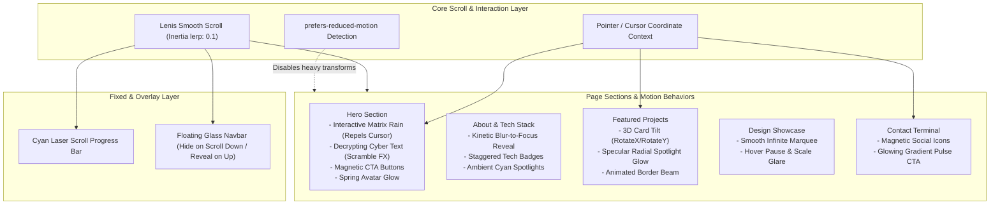

# 🚀 Motion Design System & Animation Architecture Guide
### Hirusha Suhan Portfolio — Cyberpunk / Tech Researcher Edition

> A complete, production-grade guide to transforming this portfolio into an award-winning, motion-driven experience using **Motion (Framer Motion v12)**, **Lenis Smooth Scroll**, **Tailwind CSS v4**, and **Aceternity / Magic UI** interaction patterns.

---

## 📑 Table of Contents
1. [Core Motion Philosophy & Aesthetic](#1-core-motion-philosophy--aesthetic)
2. [Animation Architecture & Flow Diagram](#2-animation-architecture--flow-diagram)
3. [Curated Resources, Inspiration & Libraries](#3-curated-resources-inspiration--libraries)
4. [Step-by-Step Implementation Roadmap](#4-step-by-step-implementation-roadmap)
5. [Production Component Recipes (Copy-Paste Code)](#5-production-component-recipes-copy-paste-code)
   - [A. Smooth Scroll Engine (`ReactLenis`)](#a-smooth-scroll-engine-reactlenis)
   - [B. Cyberpunk Text Scramble / Decryptor](#b-cyberpunk-text-scramble--decryptor)
   - [C. 3D Tilt Card with Cursor Spotlight](#c-3d-tilt-card-with-cursor-spotlight)
   - [D. Magnetic Physics Button & Social Icons](#d-magnetic-physics-button--social-icons)
   - [E. Laser Scroll Progress Beam](#e-laser-scroll-progress-beam)
   - [F. Reactive Matrix Rain (Interactive Canvas)](#f-reactive-matrix-rain-interactive-canvas)
6. [Performance, Framerate & Accessibility Guardrails](#6-performance-framerate--accessibility-guardrails)

---

## 1. Core Motion Philosophy & Aesthetic

Your portfolio combines a **JetBrains Mono typography**, **pure black `#000000` canvas**, **cyan neon `#06b6d4`**, and **matrix code rain**. The animations must enhance this identity—not feel like generic bouncy bubble animations, but rather:

- **Precision & Velocity**: Fast entrance with elastic settling (`ease: [0.16, 1, 0.3, 1]` or stiff springs).
- **Tactile Feedback**: Elements respond immediately to cursor proximity and pointer velocity (magnetic attraction, 3D tilt, specular lighting).
- **Atmospheric Depth**: Multi-layer parallax scroll, glowing backdrop blurs, and reactive canvas particles.
- **Narrative Scroll (Scrollytelling)**: Every section reveals itself like a decrypting data terminal.

---

## 2. Animation Architecture & Flow Diagram

The following diagram illustrates how user events (scroll, pointer, viewport entry) cascade through the motion layers:



---

## 3. Curated Resources, Inspiration & Libraries

### 🌟 Top Portfolio Inspiration
- **[Awwwards - Developer Portfolios](https://www.awwwards.com/websites/developer/)**: Gold standard for interactive typography, WebGL, and micro-interactions.
- **[Awwwards - Site of the Day](https://www.awwwards.com/)**: Study navigation pacing, smooth scrolling, and dark mode lighting.
- **[Framer Gallery](https://www.framer.com/gallery/)**: High-fidelity modern web interactions.
- **[Godly Website Inspiration](https://godly.website/)**: Filter by "Dark", "Cyberpunk", "Micro-interactions", and "Tech".

### 📦 Component Libraries & Animation Engines
| Resource | Purpose | URL |
| :--- | :--- | :--- |
| **Motion (Framer Motion v12)** | Industry-standard declarative React animations | [motion.dev](https://motion.dev/) |
| **Lenis** | Lightweight, modern smooth scroll library | [lenis.darkroom.engineering](https://lenis.darkroom.engineering/) |
| **Aceternity UI** | High-impact visual effects (3D cards, spotlight, border beams) | [ui.aceternity.com](https://ui.aceternity.com/) |
| **Magic UI** | Motion-first UI components for landing pages | [magicui.design](https://magicui.design/) |
| **Cubic-Bezier Tool** | Fine-tune custom easing curves | [cubic-bezier.com](https://cubic-bezier.com/) |

---

## 4. Step-by-Step Implementation Roadmap

### Phase 1: Foundation & Smooth Scroll Engine
- Install `lenis` (`npm install lenis`).
- Wrap the app in a client-side `SmoothScrollProvider` using `<ReactLenis root />`.
- Add the Cyan Laser Scroll Progress bar fixed at the top of the viewport.

### Phase 2: Hero Section & Hacker Decryptor
- Add `TextScramble` component: Animates `Hirusha Suhan` and `Frontend Developer | Designer | Tech Researcher` with high-speed random glyph shuffling when the page loads.
- Upgrade `MatrixRain`: Pass mouse coordinates so characters near the pointer scatter or illuminate in brighter neon cyan.
- Wrap hero CTA buttons in `Magnetic` spring wrappers.

### Phase 3: Project Cards (3D Tilt & Cursor Spotlight)
- Create a reusable `SpotlightCard`:
  - Tracks local mouse `x, y` within the card.
  - Dynamically renders a radial gradient glow following the cursor.
  - Uses Framer Motion's `useMotionValue` and `useSpring` to tilt `rotateX` and `rotateY` (-10deg to +10deg).

### Phase 4: Staggered Section Reveals & Bento Grid
- Replace standard fade-ins with kinetic blur reveals (`initial={{ opacity: 0, y: 30, filter: "blur(8px)" }}`).
- Stagger tech stack pills with spring delay (`transition={{ delay: index * 0.04, type: "spring", stiffness: 300 }}`).

### Phase 5: Verification & Accessibility
- Test on 60Hz and 120Hz displays.
- Verify `prefers-reduced-motion` compliance.
- Confirm zero Layout Shift (CLS = 0) and smooth 60 FPS performance.

---

## 5. Production Component Recipes (Copy-Paste Code)

All code below is fully compatible with **React 19**, **Next.js 16 (App Router)**, **Tailwind CSS v4**, and **Framer Motion v12**.

---

### A. Smooth Scroll Engine (`ReactLenis`)

Install:
```bash
npm install lenis
```

Create `src/components/providers/smooth-scroll.tsx`:
```tsx
"use client";

import { ReactLenis } from "lenis/react";
import { ReactNode } from "react";

export function SmoothScrollProvider({ children }: { children: ReactNode }) {
  return (
    <ReactLenis
      root
      options={{
        lerp: 0.08,
        duration: 1.2,
        smoothWheel: true,
        wheelMultiplier: 0.9,
      }}
    >
      {children}
    </ReactLenis>
  );
}
```

Wrap `children` in [`src/app/layout.tsx`](file:///c:/Users/hp/Desktop/myportfolio/src/app/layout.tsx):
```tsx
<SmoothScrollProvider>
  <Navbar />
  {children}
</SmoothScrollProvider>
```

---

### B. Cyberpunk Text Scramble / Decryptor

Create `src/components/ui/text-scramble.tsx`:
```tsx
"use client";

import { useEffect, useState } from "react";

const GLYPHS = "01010101_<>{}[]/*~#@!&%Hirusha";

interface TextScrambleProps {
  text: string;
  className?: string;
  speed?: number;
  trigger?: boolean;
}

export function TextScramble({
  text,
  className = "",
  speed = 35,
  trigger = true,
}: TextScrambleProps) {
  const [displayText, setDisplayText] = useState(text);

  useEffect(() => {
    if (!trigger) return;
    let iteration = 0;
    const interval = setInterval(() => {
      setDisplayText(
        text
          .split("")
          .map((char, index) => {
            if (index < iteration) {
              return text[index];
            }
            if (char === " ") return " ";
            return GLYPHS[Math.floor(Math.random() * GLYPHS.length)];
          })
          .join("")
      );

      if (iteration >= text.length) {
        clearInterval(interval);
      }
      iteration += 1 / 2;
    }, speed);

    return () => clearInterval(interval);
  }, [text, trigger, speed]);

  return <span className={className}>{displayText}</span>;
}
```

**Usage Example in `hero.tsx`:**
```tsx
<h1 className="text-4xl font-bold tracking-tight text-white sm:text-5xl md:text-6xl">
  <span className="text-cyan-400">
    <TextScramble text="Hirusha" />
  </span>{" "}
  <TextScramble text="suhan" />
</h1>
```

---

### C. 3D Tilt Card with Cursor Spotlight

Create `src/components/ui/spotlight-card.tsx`:
```tsx
"use client";

import React, { useRef, useState } from "react";
import { motion, useMotionValue, useSpring } from "framer-motion";
import { cn } from "@/lib/utils";

interface SpotlightCardProps extends React.HTMLAttributes<HTMLDivElement> {
  children: React.ReactNode;
  spotlightColor?: string;
}

export function SpotlightCard({
  children,
  className,
  spotlightColor = "rgba(6, 182, 212, 0.15)",
  ...props
}: SpotlightCardProps) {
  const cardRef = useRef<HTMLDivElement>(null);
  const [isHovered, setIsHovered] = useState(false);
  const [mousePos, setMousePos] = useState({ x: 0, y: 0 });

  // 3D rotation motion values
  const rawRotateX = useMotionValue(0);
  const rawRotateY = useMotionValue(0);

  const rotateX = useSpring(rawRotateX, { stiffness: 200, damping: 20 });
  const rotateY = useSpring(rawRotateY, { stiffness: 200, damping: 20 });

  const handleMouseMove = (e: React.MouseEvent<HTMLDivElement>) => {
    if (!cardRef.current) return;
    const rect = cardRef.current.getBoundingClientRect();
    const x = e.clientX - rect.left;
    const y = e.clientY - rect.top;

    setMousePos({ x, y });

    // Calculate rotation (-8 to +8 degrees)
    const centerX = rect.width / 2;
    const centerY = rect.height / 2;
    const rX = ((y - centerY) / centerY) * -8;
    const rY = ((x - centerX) / centerX) * 8;

    rawRotateX.set(rX);
    rawRotateY.set(rY);
  };

  const handleMouseEnter = () => setIsHovered(true);
  const handleMouseLeave = () => {
    setIsHovered(false);
    rawRotateX.set(0);
    rawRotateY.set(0);
  };

  return (
    <motion.div
      ref={cardRef}
      onMouseMove={handleMouseMove}
      onMouseEnter={handleMouseEnter}
      onMouseLeave={handleMouseLeave}
      style={{
        rotateX,
        rotateY,
        transformStyle: "preserve-3d",
      }}
      className={cn(
        "relative overflow-hidden rounded-xl border border-white/10 bg-white/5 p-6 backdrop-blur-lg transition-colors hover:border-cyan-500/40",
        className
      )}
      {...props}
    >
      {/* Specular Spotlight Gradient */}
      <div
        className="pointer-events-none absolute -inset-px transition-opacity duration-300"
        style={{
          opacity: isHovered ? 1 : 0,
          background: `radial-gradient(400px circle at ${mousePos.x}px ${mousePos.y}px, ${spotlightColor}, transparent 80%)`,
        }}
      />
      <div className="relative z-10">{children}</div>
    </motion.div>
  );
}
```

**💡 3D Avatar / Profile Card Usage Example (`public/my photo/`):**
```tsx
import Image from "next/image";
import { SpotlightCard } from "@/components/ui/spotlight-card";

export function Hero3DAvatar() {
  return (
    <SpotlightCard className="w-64 h-80 p-2 border-cyan-500/30">
      <div className="relative w-full h-full overflow-hidden rounded-lg">
        <Image
          src="/my photo/Man_in_dark_studio_portrait_2K_20260928210937.jpg"
          alt="Hirusha Suhan"
          fill
          priority
          className="object-cover transition-transform duration-500 hover:scale-105"
        />
      </div>
    </SpotlightCard>
  );
}
```

---

### D. Magnetic Physics Button & Social Icons

Create `src/components/ui/magnetic.tsx`:
```tsx
"use client";

import React, { useRef } from "react";
import { motion, useMotionValue, useSpring } from "framer-motion";

interface MagneticProps {
  children: React.ReactNode;
  strength?: number; // Distance multiplier (default: 0.35)
}

export function Magnetic({ children, strength = 0.35 }: MagneticProps) {
  const ref = useRef<HTMLDivElement>(null);

  const rawX = useMotionValue(0);
  const rawY = useMotionValue(0);

  const x = useSpring(rawX, { stiffness: 250, damping: 15 });
  const y = useSpring(rawY, { stiffness: 250, damping: 15 });

  const handleMouseMove = (e: React.MouseEvent<HTMLDivElement>) => {
    if (!ref.current) return;
    const rect = ref.current.getBoundingClientRect();
    const centerX = rect.left + rect.width / 2;
    const centerY = rect.top + rect.height / 2;

    rawX.set((e.clientX - centerX) * strength);
    rawY.set((e.clientY - centerY) * strength);
  };

  const handleMouseLeave = () => {
    rawX.set(0);
    rawY.set(0);
  };

  return (
    <motion.div
      ref={ref}
      onMouseMove={handleMouseMove}
      onMouseLeave={handleMouseLeave}
      style={{ x, y }}
      className="inline-block"
    >
      {children}
    </motion.div>
  );
}
```

**Usage:** Wrap any button or social icon:
```tsx
<Magnetic strength={0.4}>
  <SocialIcon href="https://github.com/hirushasuhan" icon={Github} label="GitHub" />
</Magnetic>
```

---

### E. Laser Scroll Progress Beam

Create `src/components/ui/scroll-progress.tsx`:
```tsx
"use client";

import { motion, useScroll, useSpring } from "framer-motion";

export function ScrollProgress() {
  const { scrollYProgress } = useScroll();
  const scaleX = useSpring(scrollYProgress, {
    stiffness: 200,
    damping: 30,
    restDelta: 0.001,
  });

  return (
    <motion.div
      style={{ scaleX }}
      className="fixed top-0 left-0 right-0 z-50 h-[2px] origin-left bg-gradient-to-r from-cyan-500 via-blue-500 to-purple-500 shadow-[0_0_12px_rgba(6,182,212,0.8)]"
    />
  );
}
```

---

### F. Reactive Matrix Rain (Interactive Canvas)

In [`src/components/ui/matrix-rain.tsx`](file:///c:/Users/hp/Desktop/myportfolio/src/components/ui/matrix-rain.tsx), add mouse interactivity and battery-saving pause when off-screen:

```tsx
// Track cursor coordinates
let mouseX = -9999;
let mouseY = -9999;

const handleMouseMove = (e: MouseEvent) => {
  mouseX = e.clientX;
  mouseY = e.clientY;
};
window.addEventListener("mousemove", handleMouseMove);

// Inside draw loop:
for (let i = 0; i < drops.length; i++) {
  const x = i * fontSize;
  const y = drops[i] * fontSize;

  // Calculate distance to mouse
  const dist = Math.hypot(x - mouseX, y - mouseY);
  if (dist < 120) {
    ctx.fillStyle = "#ffffff"; // Flash white when near cursor
    ctx.shadowBlur = 10;
    ctx.shadowColor = "#06b6d4";
  } else {
    ctx.fillStyle = "#06b6d4";
    ctx.shadowBlur = 0;
  }

  ctx.fillText(chars.charAt(Math.floor(Math.random() * chars.length)), x, y);
  drops[i]++;
}
```

---

## 6. Performance, Framerate & Accessibility Guardrails

1. **Hardware Acceleration (`GPU Layering`)**:
   Always animate `transform` (`x`, `y`, `scale`, `rotate`) and `opacity`. Never animate `width`, `height`, `margin`, or `top` which trigger browser re-layout.
2. **`prefers-reduced-motion` Support**:
   Use Framer Motion's `useReducedMotion()` hook:
   ```tsx
   import { useReducedMotion } from "framer-motion";
   const shouldReduceMotion = useReducedMotion();
   const animate = shouldReduceMotion ? false : { opacity: 1, y: 0 };
   ```
3. **Canvas Animation Lifecycle**:
   Always pause the `requestAnimationFrame` loop when `document.hidden` is `true` to save user battery and memory.
